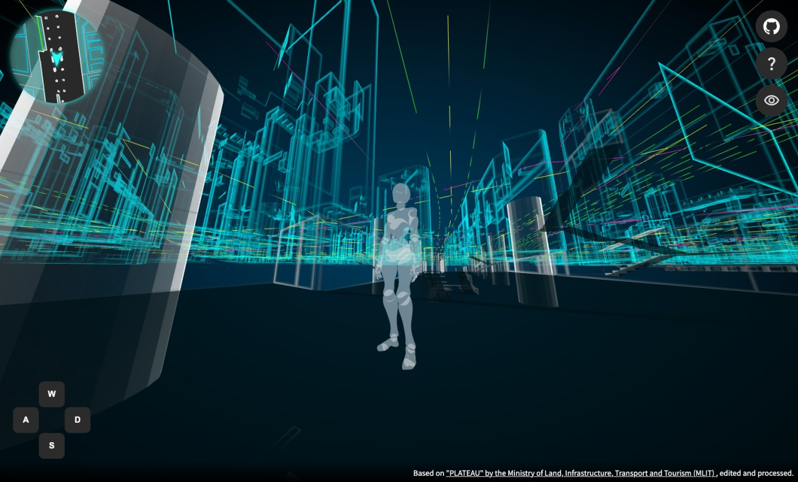

# Shinjuku Station TPS View🏙️

A TPS-style 3D map of Shinjuku Station's underground mall, built with Three.js and PLATEAU data.



## Demo

You can view the live demo [here](https://satoshi7190.github.io/three-plateau-tps/).

## Overview

This project is a 3D map of Shinjuku Station's underground mall, built with [Three.js](https://threejs.org/) and [PLATEAU](https://www.mlit.go.jp/plateau/) data. The map is designed to be viewed in a TPS (third-person shooter) style, where the user can move around the map and explore the underground mall from a bird's-eye view.

## How to Use

You can control the character using the arrow keys or the W, A, S, and D keys to move forward, left, backward, and right. Use the mouse to look around.

On mobile devices, use the on-screen joystick UI to move the character and touch and drag on the screen to adjust the camera view.


## Data Sources

This project utilizes the following datasets:

- [3D 都市モデル（Project PLATEAU）新宿区（2023 年度）](https://www.geospatial.jp/ckan/dataset/plateau-13104-shinjuku-ku-2023)

- [基盤地図情報 軌道の中心線(Railroad Track Centerline)](https://fgd.gsi.go.jp/download/menu.php)

- [地理院ベクトル 道路中心線](https://github.com/gsi-cyberjapan/experimental_rdcl?tab=readme-ov-file)

- [歩行空間ネットワークデータ（新宿駅周辺）（2018 年 3 月版適用）R1 整備\_歩行空間ネットワークデータ](https://www.hokoukukan.go.jp/metadata/resource/251)

Processing Note:

The data was converted to the [FlatGeoBuf](https://flatgeobuf.org/) format using [QGIS](https://www.qgis.org/) as part of the preprocessing workflow for efficient use within this project. For detailed steps on converting data to FlatGeoBuf, refer to [this article on Qiita](https://qiita.com/satoshi7190/items/67148db8b3149e73c4b0).

## Development Setup

To run this project locally, follow these steps:

```sh
npm install
npm run dev
```
